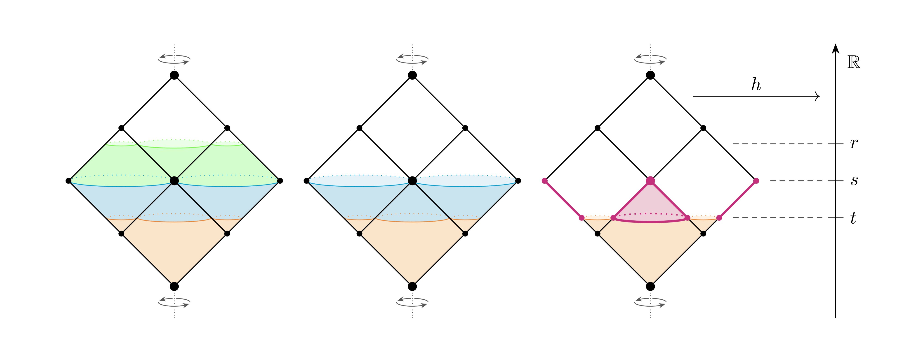

    \begin{tikzpicture}
    \begin{scope}[xshift=-9.0cm]
    \morse[toplevel=true,  midlevel=true,  conedoff=false, dlinks=false, height=false]
    \end{scope}
    \begin{scope}[xshift=-4.5cm]
    \morse[toplevel=false, midlevel=true,  conedoff=false, dlinks=false, height=false]
    \end{scope}
    \morse[toplevel=false, midlevel=false, conedoff=true,  dlinks=false]
    \end{tikzpicture}
